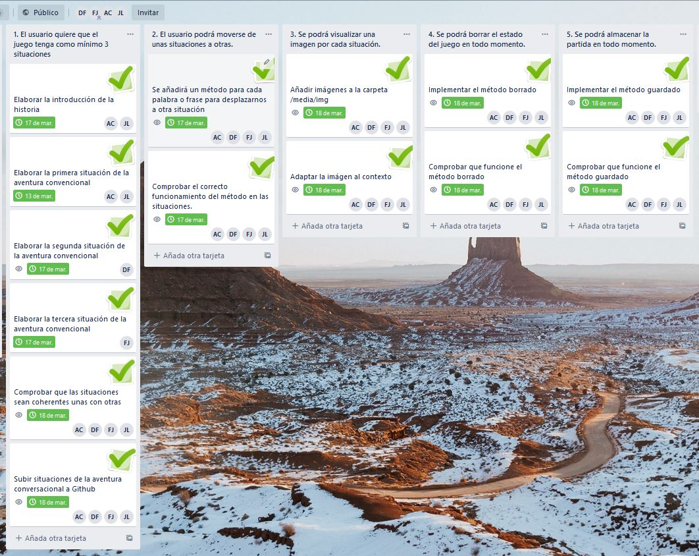

# El heredero

### Descripción del juego:
La historia narra las aventuras de un noble bastardo llamado Ferdinand en época medieval el cual se sumergirá en una aventura donde diversas situaciones repercutirán en el devenir de su vida. Su acompañante Lucía, le ayudará en su frenético viaje en la lucha contra su propia familia (Los Rhaegar) que trabajan junto al reino "Roca Rivasly",al mando del rey Lord Ashnard y su esposa, la reina Sheyla, con el objetivo de conseguir de vuelta su destino y su vida como miembro de una familia noble. En la consecución de la historia se encontrarán diversos personajes y acompañantes que aportarán a nuestro personaje un aumento en sus habilidades, obtención de nuevos objetos con los que derrotar enemigos y aumentar sus puntos de fuerza.

- Captura de pantalla del Product Backlog:

URL del tablero Trello: https://trello.com/b/8kb1jpLx/product-backlog

## Sprint 1:
- Captura del Sprint Backlog:

Hemos elegido la 1 y la 2 ya que son esenciales para contar la historia. La 3 la hemos elegido para mostrar más visualmente las situaciones y objetos de los que hablamos, para una mejor comprensión. Y la 4 y 5 las hemos elegido ya que son esenciales y para mayor comodidad del usuario.

- Captura de pantalla de las HU descompuestas en tareas al principio del Sprint:

- Capturas de pantalla del Product Backlog y del Sprint Backlog tras las modificaciones  realizadas en el Product Backlog Refinement:

**Conclusiones obtenidas en la Sprint Review:**

Hemos realizado los requisitos fundamentales para poder estructurar el proyecto y poder así desarrollarlo e incluirle nuevas funcionalidades de cara a Sprints posteriores. No se ha realizado requisitos con características demasiado particulares, dado que hemos preferido realizar los que mayor valor dan y poder así conseguir una evolución del proyecto satisfactoria.

Hemos realizado un reparto equitativo de las tareas, de forma que todos los componentes del grupo pudieran realizar, como mínimo, una tarea de cada requisito. No se ha presentado ningún problema durante el desarrollo del Sprint.

De cara al próximo Sprint, optaremos por seguir construyendo la historia y realizar requisitos con cierta funcionalidad para poder incrementar el valor de nuestra aventura conversacional. Locpróximo que mayor valor dará a nuestro proyecto será personalizar aún más nuestra página para que se adapte a la historia y nos ayude a poder mimetizarnos con la misma.

**Conclusiones obtenidas en la Sprint Retrospective:**

Se trabajó de forma correcta, gracias al reparto equitativo de tareas que nos ha ayudado a poder echarnos una mano unos a otros cuando nos atascábamos y poder así aprender. 

Se podría mejorar la claridad con la que se definen las tareas, ya que alguna vez no se ha definido bien su meta y hemos realizado a veces más cosas, y otras veces menos de lo que se nos pedía.

Nuestro plan para realizar mejoras de cara al próximo Sprint, será continuar con esta buena dinámica y poder centrarnos más en la experiencia del usuario y no tanto en los aspectos estructurales de la página.

- Captura de pantalla de las tareas del Sprint Planning al final del sprint:

- Captura de pantalla de las HU del Sprint Backlog una vez acabado el sprint:

